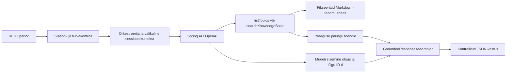

# Arhitektuur

`docs/assignment.md` on ainus normatiivne nõuete allikas. See dokument kirjeldab valmis lahendust ega lisa ülesandele uusi nõudeid.

## Süsteemi kuju

Rakendus on üks sünkroonne Java 21 ja Spring Booti protsess. REST-kontroller annab küsimuse turvakontrollile, orkestreerija teeb sama päringu jaoks esmalt deterministliku otsingu lubatud teadmusbaasi tööriistaga ning loob eraldi süsteemi- ja kasutajasõnumid. Spring AI kutsub OpenAI mudelit ja annab mudelile ainult kaks teadmusbaasi tööriista. Viis Markdown-dokumenti laaditakse fikseeritud classpath-manifestist käivitamisel mällu.

Paketid eraldavad API, agendi orkestreerimise, sisenditurbe, teadmusbaasi ja avaliku vastuse koostamise. `AgentModelGateway` peidab Spring AI ja OpenAI integratsiooni, et unit-testid saaksid mudeli asendada deterministliku test-double'iga.

## Põhiotsused

Teadmusbaas on väike ja staatiline, seega kasutab `KnowledgeBaseRepository` normaliseeritud märksõna- ja aliaseotsingut. Embeddings, vektorandmebaas ja väline otsing ei annaks ülesande kohustuslikele kasutusjuhtudele vajalikku lisaväärtust.

Otsinguküsimus ja järelküsimuse jaoks moodustatud kontekstipäring on piiratud 2 000 tähemärgiga. Repository ei aktsepteeri küsimust tõendina ainult teema kattumise põhjal: kõik sisulised terminid peavad olema seotud leitud lõikudega või curated aliastega. Seetõttu lükatakse tagasi ka teadaoleva teema kohta esitatud, kuid dokumendis toetamata detailiküsimused.

`KnowledgeBaseTools` eksponeerib Spring AI-le ainult `listTopics` ja `searchKnowledgeBase`. Otsinguargument on andmestring, mitte failitee. Repository avab ainult manifestis nimetatud classpath-ressursid; tööriistadel puuduvad võrgu-, kirjutamis- ja käsuvõimed.

Mudel ei koosta avalikku vastust. Ta tagastab `AgentDecision` objekti, mille action on `ANSWER`, `LIST_TOPICS`, `CLARIFY` või `REFUSE`, ning valib tööriistatulemustes olnud lõikude ID-d. `CurrentTurnEvidence` kogub ainult sama päringu jooksul tagastatud kanoonilised lõigud. Orkestreerija esmane tööriistaotsing tagab, et mudeli juhuslik tööriistakutse vahelejätmine või põhjendamatu keeldumine ei muudaks toetatud küsimust veaks. `GroundedResponseAssembler` võib sellise otsuse taastada ainult siis, kui algne küsimus läbib sõltumatu relevantsuskontrolli ja sama päringu tööriistatõend on kanooniline. Toetamata detaili puhul on otsing tühi ja keeldumist ei taastata. Seetõttu ei saa mudeli väljamõeldud allikas ega faktiline proosa avalikku API vastusesse jõuda.

`CurrentTurnEvidence` kasutab `ThreadLocal`-it ning tugineb rakenduse praegusele sünkroonsele eeldusele, et orkestreerimine, mudelikõne ja tööriistakutsed täidetakse sama päringulõime kontekstis. Asünkroonse tööriistatäitmise korral ei ole see eeldus piisav: siis tuleb tõendikontekst muuta eksplitsiitselt request-scoped'iks ning kontrollida paralleelpäringute isolatsiooni eraldi testidega.

Kõik `refused:false` vastused sisaldavad vähemalt ühte allikat ning iga allikas on vastuses kujul `[allikas: fail.md]`. Toetuseta, skoopiväline, ohtlik või vigaselt maandatud otsus muutub rakenduse koostatud eestikeelseks keeldumiseks.

## Turvapiirid

`AskRequest` ja `RequestSecurityService` peatavad tühja või üle 2000 märgi sisendi enne mudelit. Turvateenus keeldub teadaolevatest prompt injection'i, rollimuutuse, prompti või tööriistade avaldamise, path traversal'i, destruktiivsete juhiste ja ilmsete saladuste mustritest. Logitakse kategooria ja pikkus, mitte täisküsimus.

Süsteemiprompt tuleb versioonitud ressursist. Küsimus ja varasemad vahetused lisatakse Spring AI sõnumitena oma rollides ning neid ei liideta süsteemiprompti. Mudelile ei anta üldist tööriista. Rakenduse väljundipiir valideerib mudeli otsuse uuesti ja kasutab ainult sünteetilist teadmusbaasi.

Valikuline `sessionId` on läbipaistmatu kontekstivõti, mitte autentimine. `SessionStore` säilitab protsessi mälus kuni neli viimast valideeritud vahetust sessiooni kohta, piirab sessioonide koguarvu 1000-ni ja eemaldab sessiooni 30 minuti tegevusetuse järel. Ajalugu aitab järelküsimust mõista, kuid iga vastuse tõendid otsitakse uuesti. Andmed kaovad restardil ja neid ei jagata instantside vahel.

## API ja vead

- `POST /api/v1/agent/ask` võtab kohustusliku `question`-i ja valikulise `sessionId`-i.
- `GET /api/v1/health` tagastab lokaalse liveness-oleku ilma OpenAI kutseta.
- Vigane sisend saab HTTP 400; turvaline keeldumine saab HTTP 200 koos `refused:true`; mudeli konfiguratsiooni või teenuse puudumine saab sanitiseeritud HTTP 503.
- Vastuse väljad on `answer`, `sources`, `confidence`, `refused` ja `refusalReason`; allikas sisaldab `file`, `title` ja `excerpt`.

## Testi- ja CI-piir

`test` task katab rakenduse enda loogika ilma võtme või võrguta. `integrationTest` käivitab päris REST → Spring AI → OpenAI voo ja nõuab enne testide alustamist mittetühje `OPENAI_API_KEY` ning `OPENAI_MODEL` väärtusi; puuduv konfiguratsioon põhjustab vea, mitte testide vaikse vahelejätmise. Integratsioonitestid katavad lisaks kasutusjuhtudele `GROUND-01` ja `GROUND-02`, mis kontrollivad toetamata detailide tagasilükkamist. Unit-testide HTML raport avaldatakse iga kontrolljooksu korral. Päris OpenAI testid on eraldi käsitsi käivitatavas `live-integration.yml` workflow's ja kasutavad kaitstud `openai-integration` Environment'i, et tavapärase pull request'i kood ei saaks API-võtit.

Gradle'is on lisaks seadistatud Checkstyle, PMD, SpotBugs/FindSecBugs ja JaCoCo; `./gradlew check` käivitab need kontrollid ning nõuab vähemalt 70% ridade katvust. CI lisakontrollid on dokumenteeritud failis `docs/ci-static-analysis.md`: CodeQL, actionlint/ShellCheck, zizmor, Semgrep CE, Gradle dependency submission ja OpenSSF Scorecard. Need täidavad vastavalt semantilise turvaanalüüsi, workflowde korrektse süntaksi, Actionsi turvahügieeni, mustripõhise SAST-i, sõltuvusgraafi ja tarneahela posture'i rolli ega dubleeri Gradle'i Java-analüsaatoreid.

Rate limiting, mudelikõnede concurrency-piirid ja operatiivmõõdikud jäävad välja, sest ülesanne eelistab väikest lahendust ega nõua tootmiskõlblikku infrastruktuuri. OpenAI HTTP-päringul on seadistatav 30-sekundiline vaike-timeout. Gradle'i lokaalsed Checkstyle-, PMD-, SpotBugs/FindSecBugs- ja JaCoCo-kontrollid on siiski olemas. Püsiv andmebaas, autentimisplatvorm, väline otsing, streaming, mitme instantsi koordineerimine ja deployment-infrastruktuur jäävad samuti välja. Samal põhjusel vastab üks Markdown-fail ühele lõigule; suurema korpuse korral vajaks otsing heading'u- või lõigupõhist tükeldamist.
