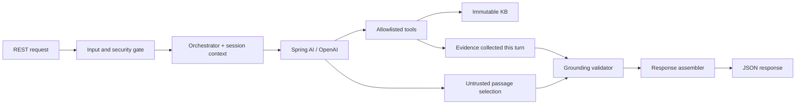

# Architecture: bounded IT knowledge-base agent

## Summary

`docs/architecture.md` is authoritative for design decisions; `docs/assignment.md` defines assignment requirements, and `docs/requirements-matrix.md` traces those requirements to the selected design.

Build one synchronous Spring Boot application with Spring AI and OpenAI, Java 21, and Gradle Wrapper. Use five static Markdown documents, two read-only tools, and bounded in-memory sessions.

The assignment prioritizes controlled behavior, source grounding, security, and application-level validation without prescribing the internal model-output format.

Use the selected **extractive answer policy**: the model chooses relevant retrieved passages; the application renders their exact text with citations. Model-generated factual prose never reaches the public response.

No database, embeddings, external business integrations, authentication platform, or deployment infrastructure.

## Core grounding invariant

```text
The LLM never constructs trusted citations or source excerpts.

Knowledge tools return canonical passage IDs and content from the allowlisted
knowledge base. The model may select only passage IDs made available through
those tools.

The application resolves selected passage IDs against retrieved canonical
passages and constructs the public answer and sources.

A factual response with refused=false is permitted only when it is fully
grounded in validated retrieved passages. Low confidence does not bypass this
requirement.

If grounding cannot be established, the application returns refused=true.
```

Evidence must be retrieved through allowlisted tools in the current request. Session history provides context only; follow-ups must re-retrieve their evidence.

## Components and boundaries

Organize one application module into seven packages:

| Package | Responsibility |
|---|---|
| `api` | REST controllers, public DTOs, request binding, HTTP error mapping |
| `security` | Input limits, injection and sensitive-data detection, safe logging |
| `agent` | Turn orchestration, Spring AI adapter, system/user role separation, bounded tool loop |
| `knowledge` | Immutable KB repository, passage search, explicit tool registration |
| `response` | Evidence validation, deterministic answer assembly, refusal templates |
| `session` | Bounded conversation context and session lifecycle |
| `config` | Typed settings, provider configuration, component wiring |

Controllers depend on orchestration; orchestration coordinates the other components. Spring AI types remain inside the model/tool integration boundary. Use an application-owned model gateway interface so tests can replace OpenAI with a deterministic fake.



## Runtime and interfaces

- Preserve `POST /api/v1/agent/ask` with required `question` and optional `sessionId`. Preserve response fields `answer`, `sources`, `confidence`, `refused`, and `refusalReason`.
- `GET /api/v1/health` returns `{"status":"UP"}` without contacting OpenAI. With no API key, the application can start and serve health; asking returns HTTP 503.
- Validate questions as nonblank and at most 2,000 characters. Session IDs are opaque, case-sensitive strings of 1–128 ASCII letters, digits, underscores, or hyphens.
- Return HTTP 400 for invalid requests; HTTP 200 with a deterministic Estonian refusal for unsafe, unsupported, or invalidly grounded requests; HTTP 503 for provider unavailability/timeouts; sanitized HTTP 500 for unexpected application errors.

### Three separate contracts

```text
Tool result:
KnowledgePassage(id, file, title, text)

Model decision:
AgentDecision(action, selectedPassageIds, clarificationIntent/refusalReason)

Public API:
AgentResponse(answer, sources, confidence, refused, refusalReason)
```

`action` is one of `ANSWER`, `LIST_TOPICS`, `CLARIFY`, or `REFUSE`. Clarification intents and refusal reasons in the model decision are closed categories, never public prose. The application maps them to fixed Estonian templates. Tool passage IDs are internal and never required in the public API. The model is an untrusted decision-maker, tools provide canonical evidence, and Java constructs the trusted public response.

### Knowledge and tools

- Load an explicit manifest of `gitlab-access.md`, `kubernetes-deploy.md`, `cicd.md`, `code-review.md`, and `access-management.md` at startup. Missing or malformed documents fail startup.
- Split curated Estonian content into short, independently understandable passages with stable document/passage IDs. Keep titles, aliases, and passages in immutable records.
- Search uses normalized token matching with curated Estonian/English aliases, prioritizing title and alias matches, then passage matches. Return at most five passages with deterministic tie-breaking.
- Register exactly `listTopics()` and `searchKnowledgeBase(query)`. Search input is a bounded string, never a path. Topic listing returns the five actual document titles and a canonical short topic-description passage for each topic (`KnowledgePassage`).
- Record every returned passage in a request-local evidence ledger. No shared mutable retrieval state or arbitrary resource-reading tool.
- Use application-controlled Spring AI tool execution: at most four model calls and six tool invocations per request, with a 30-second total deadline. Unknown tools, malformed arguments, and exhausted limits terminate safely.

### Model output and grounding

- The internal model result contains a decision—`ANSWER`, `LIST_TOPICS`, `CLARIFY`, or `REFUSE`—and selected passage IDs or a closed refusal category. It does not mirror the public response DTO.
- Accept only IDs present in the current turn’s evidence ledger. An existing but unretrieved document is insufficient.
- Assemble answers from exact selected passages and append `[allikas: filename]` to each passage. Build source filenames, titles, and excerpts from repository records; deduplicate sources.
- Render topic lists from validated document titles and topic-description excerpts.
- For ambiguous deploy questions, return a fixed Estonian clarification asking whether the user means Kubernetes or CI/CD, accompanied by validated topic sources.
- Assign `high` to validated extractive answers/topic lists and `low` only to grounded ambiguous clarification (`refused:false`, with validated sources). Refusals use `confidence:null`, `refused:true`, a fixed reason, and empty sources; confidence is not applicable when no factual answer is given. Do not emit `medium`. Confidence describes evidence status, not calibrated probability.
- Successful responses have `refusalReason:null`.
- Malformed selections, missing evidence, and unsupported output become fixed refusals. Never pass through model-written refusal prose or attempt to repair facts by guessing.

## Security and session behavior

- Fail fast on documented English/Estonian injection, prompt/tool disclosure, traversal, and obvious credential/personal-code patterns. Refuse the entire mixed legitimate/malicious request.
- Keep the trusted system prompt in a versioned resource. User messages, history, and tool results retain their own roles and never enter system instructions.
- Use synthetic KB content only. Log request ID, outcome category, lengths, and timing; disable prompt, tool-payload, and provider-body logging. Document that pattern detection cannot identify every sensitive input.
- Store only accepted user questions and validated application responses: four exchanges per session, 15-minute idle TTL, maximum 1,000 sessions, oldest-idle eviction.
- Serialize turns within a session; allow different sessions concurrently. Re-retrieve evidence for follow-ups instead of treating history as proof. Refused and failed turns do not enter memory.
- Treat session IDs as caller-managed context keys, not authentication. Document restart loss, single-instance operation, and the need for unpredictable IDs.
- Omit optional rate limiting from the initial implementation and document that limitation.

## Verification and implementation order

1. Keep this authoritative architecture and the requirements matrix aligned around extractive assembly, current-turn evidence, and the three separate contracts.
2. Scaffold build/configuration and health, then implement KB/tools, request validation, response validation, model orchestration, and sessions—with tests alongside each stage.
3. Run `./gradlew test` without an API key. Cover API validation, retrieval, exact tool registration, budgets, role separation, cross-request evidence isolation, fabricated/unretrieved IDs, citation assembly, session expiry/isolation, and sanitized failures.
4. Add separate `./gradlew integrationTest` coverage for API-04, UC-01–13, SEC-01–06, and SEC-08. Skip cleanly without `OPENAI_API_KEY`; assert behavior and provenance rather than exact model wording.
5. For SEC-01–06 and SEC-08, test the original attacks through REST and assert no provider call when the pre-filter blocks them. Each ID must also have a real-model REST → agent → OpenAI integration case. If the original string is blocked, add a semantically equivalent synthetic adversarial variant that passes the unchanged detector, assert that the provider was called, and verify the same safety outcome. Do not disable or weaken production filters for these tests. Keep SEC-07 in keyless unit/API tests with HTTP 400 and no provider call; never force overlong input through the model.
6. Require exact IDs in display names, such as `@DisplayName("UC-01 - direct GitLab access question")` and `@DisplayName("SEC-01 - direct prompt injection")`. Publish separate HTML reports through GitHub Actions, inspect the final diff, and document remaining requirements and actual test results.

Require `OPENAI_MODEL` to name an organization-approved model; do not assume approval for a default. Any `.env.example` model value must be labeled as an example, not a guaranteed approved default. Pin a documented compatible stable Spring Boot/Spring AI/Gradle combination when preparing the scaffold.

Current state: architecture recorded before scaffolding. The repository has no Gradle Wrapper or application. The requirements matrix reflects this design; implementation and keyed integration evidence remain outstanding.
